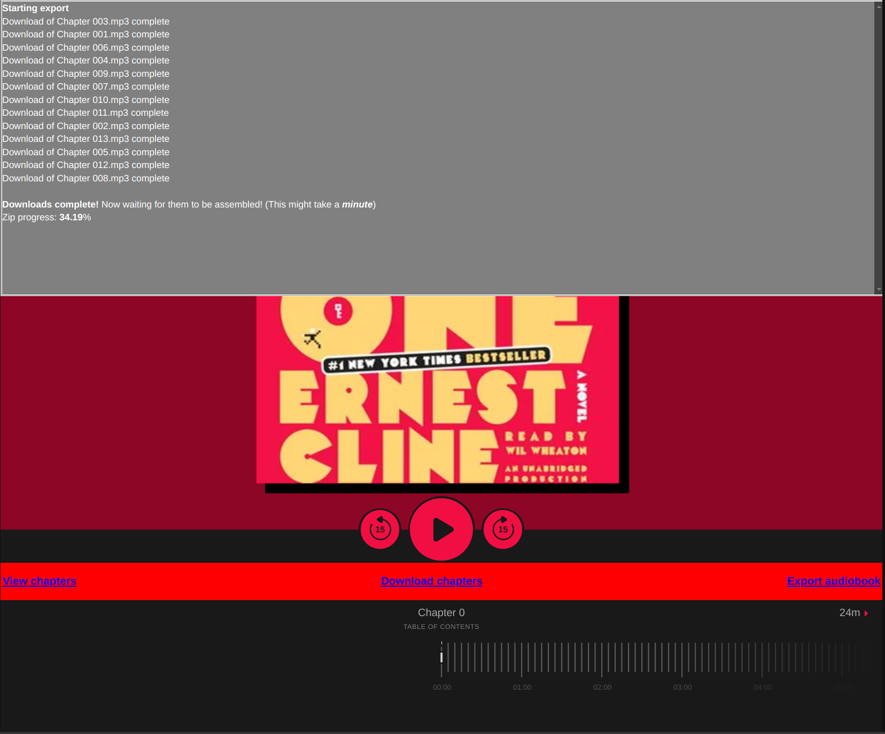

# LibbyRip

Rip all your favorite audiobooks from libby!




<sup>Be careful, I have had multiple library cards banned in the past from using this tool (See [#14](https://github.com/HeronErin/LibbyRip/issues/14), [#12](https://github.com/HeronErin/LibbyRip/issues/12), and [#8](https://github.com/HeronErin/LibbyRip/issues/8) for more details) </sup>

## How to use

1. Install the [TamperMonkey](https://www.tampermonkey.net/) extension for your browser.
2. Install the userscript from the [GreasyFork page](https://greasyfork.org/en/scripts/498782-libregrab)
3. Find your audiobook on Libby and export.

**NOTE:** If you do not see anything, it _could_ be because TamperMonkey is not set up properly on Chrome (and chromeium based) browsers! See the TamperMonkey [FAQ](https://www.tampermonkey.net/faq.php#Q209) page here for more info.

<a href='https://ko-fi.com/V7V81BFLAH' target='_blank'></a>

## Converting into a better format

If the built-in mp3 converter fails, try out the scripts made bu [`Cerina witha Sea`](https://github.com/cerinawithasea) to convert them into the m4b [here](https://github.com/cerinawithasea/libregrab-m4b-creator)!
 
## Using the Python script

The Python script provided with this repo provides an optional way to bake metadata in your downloaded media.

To run the script Python is required, and you must install the dependencies using the following command:
```bash
pip install -r requirements.txt
```
Then simply run the script, and drag-and-drop the extracted folder with your audiobook in it. (You must extract the zip file, then use the folder with mp3s in it)
If you wish to use the script to make metadata, you must `Export audiobook` to include the metadata in the zip file.

<sup>Note If you are getting a `Lame tag CRC check failed` mesage, that is **not** an error, just a warning, and it means nothing for you. It will still bake the metadata, just means _something_, is wrong with the mp3 Libby gave. (Not actually sure what the issue is myself)</sup>
<hr>

**Disclaimer:** This tool is intended for educational and personal research purposes only. The developers do not condone or encourage any illegal activity, including the unauthorized distribution or reproduction of copyrighted content. By using this tool, you accept full responsibility for your actions and agree to comply with all applicable laws. Use at your own risk.
